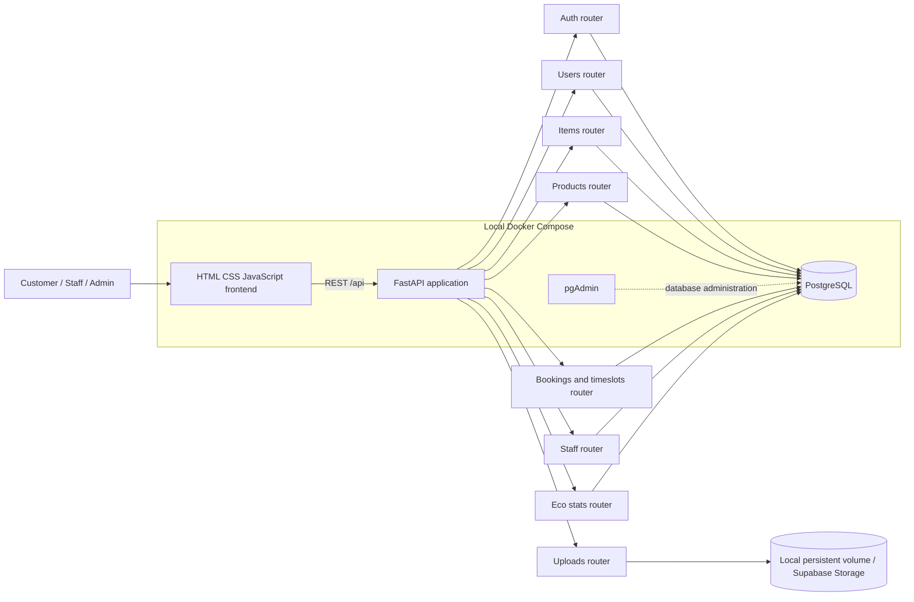
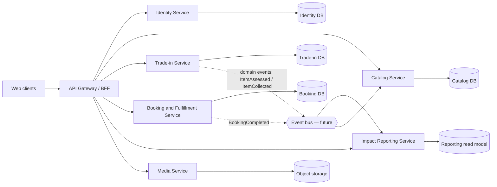

# Microservices Architecture — The Disposal Guilt

เอกสารนี้แสดงทั้งสถาปัตยกรรมที่เชื่อมต่อและใช้งานอยู่ใน repo ปัจจุบัน และแนวทางแยกบริการในอนาคตเพื่อรองรับการขยายระบบ

## สถานะปัจจุบัน

ระบบปัจจุบันเป็น **modular monolith**: FastAPI หนึ่งแอปแบ่ง router ตามโดเมน ใช้ฐานข้อมูล PostgreSQL ร่วมกัน และให้บริการหน้าเว็บแบบ static ผ่านแอปเดียวกัน ส่วน Vercel ใช้ frontend แบบ static และ FastAPI serverless entrypoint เดียว สถาปัตยกรรมนี้ deploy และพัฒนาได้ง่าย แต่ยังไม่ใช่ microservices ที่ deploy แยกอิสระ

## เป้าหมายเมื่อแยกเป็น Microservices

แผนภาพด้านล่างเป็น **เป้าหมายเชิงออกแบบ** ไม่ใช่บริการที่ deploy อยู่ใน repo ขณะนี้ แบ่งตามความรับผิดชอบในโดเมน และเริ่มแยกได้เมื่อมีความจำเป็นด้านการ scale หรือ ownership

## ขอบเขตบริการเป้าหมาย

| บริการ | ความรับผิดชอบ | ข้อมูลที่ควรเป็นเจ้าของ |
|---|---|---|
| Identity | สมัคร/เข้าสู่ระบบ, JWT, roles, โปรไฟล์ | users, credentials |
| Catalog | สินค้า หมวดหมู่ และสต็อก | products, inventory |
| Trade-in | ประเมินเฟอร์นิเจอร์ รูปภาพ และสถานะรายการเก่า | items, assessments |
| Booking and Fulfillment | รอบนัดหมาย การจอง และงานช่าง | timeslots, bookings |
| Impact Reporting | สถิติ CO₂ และรายงานส่วนบุคคล/ระบบ | read model จากเหตุการณ์ |
| Media | รับไฟล์และออก URL สำหรับรูปภาพ | object storage metadata |

## ลำดับการแยกบริการที่แนะนำ

1. รักษา modular monolith ปัจจุบันให้สัญญา API และ ownership ของข้อมูลชัดเจนก่อน
2. แยก Media Service ก่อน เพราะเชื่อมกับ Supabase Storage อยู่แล้วและเป็นขอบเขตที่ค่อนข้างอิสระ
3. แยก Identity และ Catalog เมื่อมีเหตุผลด้านการใช้งานหรือทีมดูแล โดยกำหนดสัญญา API และแผนย้ายข้อมูล
4. แยก Booking กับ Trade-in พร้อมกลไกจัดการความสอดคล้องของข้อมูลและการ retry ก่อนใช้ event bus
5. สร้าง reporting read model จากเหตุการณ์เมื่อการอ่านสถิติเริ่มกระทบฐานข้อมูลธุรกรรม

การแยกบริการจะเพิ่มภาระ deploy, monitoring, network failure handling และ data consistency จึงควรทำเป็นระยะ และไม่ควรอ้างว่าแผนภาพเป้าหมายนี้เป็น implementation ปัจจุบัน

